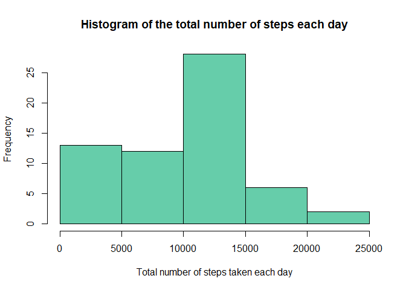
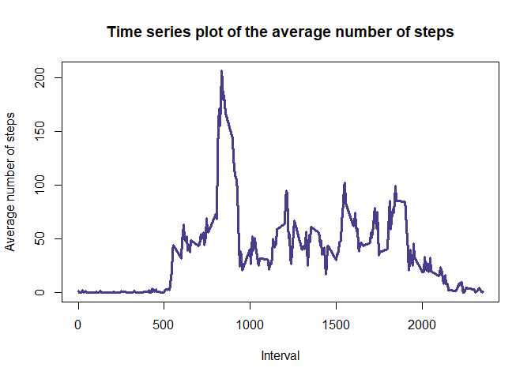
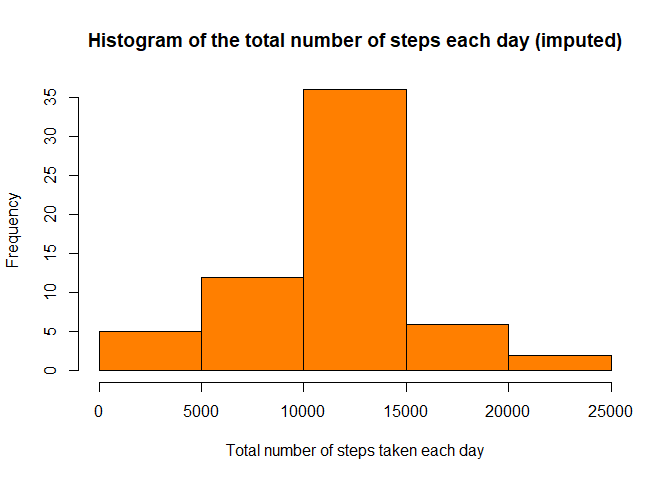
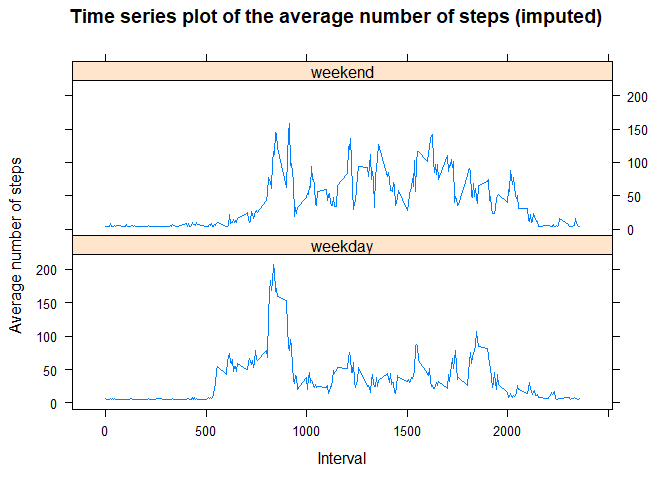

# Reproducible Research: Course Project 1


## A. Missing values ignored

### A1. Code for reading in the dataset and/or processing the data

```r
## Load data and look at it
activity <- read.csv("activity.csv", header = TRUE, sep = ",")
dim(activity)
```

```
## [1] 17568     3
```

```r
str(activity)
```

```
## 'data.frame':	17568 obs. of  3 variables:
##  $ steps   : int  NA NA NA NA NA NA NA NA NA NA ...
##  $ date    : Factor w/ 61 levels "2012-10-01","2012-10-02",..: 1 1 1 1 1 1 1 1 1 1 ...
##  $ interval: int  0 5 10 15 20 25 30 35 40 45 ...
```

```r
head(activity)
```

```
##   steps       date interval
## 1    NA 2012-10-01        0
## 2    NA 2012-10-01        5
## 3    NA 2012-10-01       10
## 4    NA 2012-10-01       15
## 5    NA 2012-10-01       20
## 6    NA 2012-10-01       25
```

```r
summary(activity)
```

```
##      steps                date          interval     
##  Min.   :  0.00   2012-10-01:  288   Min.   :   0.0  
##  1st Qu.:  0.00   2012-10-02:  288   1st Qu.: 588.8  
##  Median :  0.00   2012-10-03:  288   Median :1177.5  
##  Mean   : 37.38   2012-10-04:  288   Mean   :1177.5  
##  3rd Qu.: 12.00   2012-10-05:  288   3rd Qu.:1766.2  
##  Max.   :806.00   2012-10-06:  288   Max.   :2355.0  
##  NA's   :2304     (Other)   :15840
```


### A2. Histogram of the total number of steps each day


```r
## Calculate the total number of steps per day
tnspd <- with(activity, tapply(steps, date, sum, na.rm=T))
head(tnspd)
```

```
## 2012-10-01 2012-10-02 2012-10-03 2012-10-04 2012-10-05 2012-10-06 
##          0        126      11352      12116      13294      15420
```

```r
## Make plot
hist(tnspd, col="aquamarine3", main="Histogram of the total number of steps each day", xlab = "Total number of steps taken each day", ylab= "Frequency")
```

<!-- -->


### A3. Mean and median number of steps each day


```r
m1 <- mean(tnspd, na.rm=TRUE)
m2 <- median(tnspd, na.rm=TRUE)
m1
```

```
## [1] 9354.23
```

```r
m2
```

```
## [1] 10395
```

The mean is 9354.2295082, the median is 10395.


### A4. Time series plot of the average number of steps


```r
## Calculate the average number of steps per interval (on all days)
anspi <- aggregate(steps ~ interval, activity, FUN="mean")
head(anspi)
```

```
##   interval     steps
## 1        0 1.7169811
## 2        5 0.3396226
## 3       10 0.1320755
## 4       15 0.1509434
## 5       20 0.0754717
## 6       25 2.0943396
```

```r
## Make plot
plot(anspi$interval,anspi$steps, type = "l", col="darkslateblue", lwd=3,main="Time series plot of the average number of steps", xlab = "Interval", ylab= "Average number of steps")
```

<!-- -->


### A5. The 5-minute interval that, on average, contains the maximum number of steps


```r
anspi[which.max(anspi$steps),]
```

```
##     interval    steps
## 104      835 206.1698
```

## B. Missing values imputed

### B1.Imputing missing data

Note that there are a number of days/intervals where there are missing values (coded as NA). The presence of missing days may introduce bias into some calculations or summaries of the data.

- Calculate and report the total number of missing values in the dataset


```r
summary(activity)
```

```
##      steps                date          interval     
##  Min.   :  0.00   2012-10-01:  288   Min.   :   0.0  
##  1st Qu.:  0.00   2012-10-02:  288   1st Qu.: 588.8  
##  Median :  0.00   2012-10-03:  288   Median :1177.5  
##  Mean   : 37.38   2012-10-04:  288   Mean   :1177.5  
##  3rd Qu.: 12.00   2012-10-05:  288   3rd Qu.:1766.2  
##  Max.   :806.00   2012-10-06:  288   Max.   :2355.0  
##  NA's   :2304     (Other)   :15840
```

```r
mi1 <- sum(is.na(activity$steps))
mi2 <- mean(is.na(activity$steps))*100
mi1
```

```
## [1] 2304
```

```r
mi2
```

```
## [1] 13.11475
```


As can be seen in the summary, only steps have missing values.
There are 2304 values missing for steps, which is 13.1147541 %.

- Devise a strategy for filling in all of the missing values in the dataset. The strategy does not need to be sophisticated.

The missing steps are simply filled with the mean of steps across all days and intervalls.

- Create a new dataset that is equal to the original dataset but with the missing data filled in.


```r
activityImputed <- activity

## before imputing
head(activityImputed)
```

```
##   steps       date interval
## 1    NA 2012-10-01        0
## 2    NA 2012-10-01        5
## 3    NA 2012-10-01       10
## 4    NA 2012-10-01       15
## 5    NA 2012-10-01       20
## 6    NA 2012-10-01       25
```

```r
# imputing 
activityImputed$steps[is.na(activityImputed$steps)] <- mean(activityImputed$steps, na.rm=TRUE)

## after imputing
head(activityImputed)
```

```
##     steps       date interval
## 1 37.3826 2012-10-01        0
## 2 37.3826 2012-10-01        5
## 3 37.3826 2012-10-01       10
## 4 37.3826 2012-10-01       15
## 5 37.3826 2012-10-01       20
## 6 37.3826 2012-10-01       25
```


### B2. Histogram of the total number of steps each day


```r
## Calculate the total number of steps taken per day
tnspdimputed <- with(activityImputed, tapply(steps, date, sum, na.rm=T))

## Make plot
hist(tnspdimputed, col="darkorange1", main="Histogram of the total number of steps each day (imputed)", xlab = "Total number of steps taken each day", ylab= "Frequency")
```

<!-- -->


### B3. Mean and median number of steps  each day


```r
mean(tnspdimputed, na.rm=TRUE)
```

```
## [1] 10766.19
```

```r
median(tnspdimputed, na.rm=TRUE)
```

```
## [1] 10766.19
```

- Do these values differ from the estimates from the first part of the assignment? 

Before imputation the mean was 9354.2295082, the median was 10395.

The mean and the median increased after imputation.

- What is the impact of imputing missing data on the estimates of the total daily number of steps?

This somewhat brutal method of imputation flattens the variation by day and interval.


### B4. Panel plot comparing the average number of steps taken per 5-minute interval across weekdays and weekends

Are there differences in activity patterns between weekdays and weekends?

- Create a new factor variable in the dataset with two levels – “weekday” and “weekend” indicating whether a given date is a weekday or weekend day.


```r
activityImputed$dayofweek <- weekdays(as.Date(activityImputed$date), abbreviate=T)
head(activityImputed)
```

```
##     steps       date interval dayofweek
## 1 37.3826 2012-10-01        0        Mo
## 2 37.3826 2012-10-01        5        Mo
## 3 37.3826 2012-10-01       10        Mo
## 4 37.3826 2012-10-01       15        Mo
## 5 37.3826 2012-10-01       20        Mo
## 6 37.3826 2012-10-01       25        Mo
```

```r
activityImputed$weekdayend <- "weekday"
head(activityImputed)
```

```
##     steps       date interval dayofweek weekdayend
## 1 37.3826 2012-10-01        0        Mo    weekday
## 2 37.3826 2012-10-01        5        Mo    weekday
## 3 37.3826 2012-10-01       10        Mo    weekday
## 4 37.3826 2012-10-01       15        Mo    weekday
## 5 37.3826 2012-10-01       20        Mo    weekday
## 6 37.3826 2012-10-01       25        Mo    weekday
```

```r
activityImputed[activityImputed$dayofweek=="So",]$weekdayend <- "weekend"
activityImputed[activityImputed$dayofweek=="Sa",]$weekdayend <- "weekend"
activityImputed$weekdayend <- as.factor(activityImputed$weekdayend)
```

*) „So“ like „Sonntag“ is Sunday in German

- Make a panel plot containing a time series plot of the 5-minute interval (x-axis) and the average number of steps taken, averaged across all weekday days or weekend days (y-axis). 


```r
anspiImputed <- aggregate( steps ~ interval + weekdayend, activityImputed, FUN="mean")
head(anspiImputed)
```

```
##   interval weekdayend    steps
## 1        0    weekday 7.006569
## 2        5    weekday 5.384347
## 3       10    weekday 5.139902
## 4       15    weekday 5.162124
## 5       20    weekday 5.073235
## 6       25    weekday 6.295458
```

```r
library(lattice)
xyplot(steps ~ interval | weekdayend, anspiImputed, layout = c(1, 2), type = "l", main="Time series plot of the average number of steps (imputed)",xlab = "Interval", ylab = "Average number of steps")
```

<!-- -->
